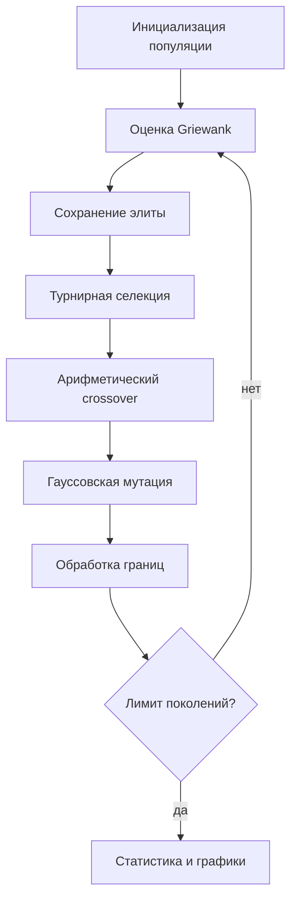

# Отчёт по лабораторной работе №1

## 1. Постановка задачи
Вариант 5: минимизация функции Гриванка в размерности `d = 5 + (5 mod 6) = 10` на области `[-600, 600]^10`.

Целевая функция:
`f(x)=1 + (1/4000) Σ x_i² - Π cos(x_i/√i)`. Глобальный минимум равен 0 в точке `x=0`.

## 2. Представление решения
Генотип и фенотип совпадают: вещественный вектор из 10 координат. Декодирование не требуется. После мутации координаты возвращаются в допустимые границы.

## 3. Алгоритм
Используются инициализация в допустимой области, турнирная селекция, арифметическая рекомбинация, гауссовская мутация, обработка границ и элитизм. Эксперимент выполняется с фиксированным числом поколений и воспроизводимыми seed.

## 4. Эксперимент
Проведено 20 независимых запусков для двух конфигураций, различающихся только вероятностью мутации: `0.05` и `0.20`. Дополнительно выполнен Random Search при том же бюджете вычислений целевой функции. Результаты находятся в `results/runs.csv`, агрегированная статистика — в `results/summary.txt`.

Графики `convergence_GA_mut_0.05.png` и `convergence_GA_mut_0.20.png` показывают сходимость по серии запусков; `comparison.png` сравнивает итоговые результаты.

## 5. Результаты
По сохранённой серии запусков:
- GA, mutation=0.05: best `7.8033e-05`, mean `0.05420`, median `0.04811`, std `0.03502`, worst `0.12546`.
- GA, mutation=0.20: best `0.19289`, mean `0.38077`, median `0.40068`, std `0.12046`, worst `0.57121`.
- Random Search: best `25.4493`, mean `40.8372`, median `42.2240`, std `7.3583`, worst `53.3833`.

В данной постановке вероятность мутации `0.05` дала более низкие итоговые значения, чем `0.20`. Это экспериментальный вывод для выбранных параметров, а не утверждение об универсально оптимальной вероятности.

## 6. Почему задача сложна
Функция Гриванка многомодальна: произведение косинусов создаёт большое число локальных структур. В 10-мерной области случайному поиску трудно попасть в малую окрестность глобального минимума, а локальный метод может зависеть от начальной точки.

## 7. Вывод
ГА существенно превзошёл случайный поиск при сопоставимом бюджете. Лучший результат близок к известному глобальному минимуму 0. Серия из 20 запусков показывает устойчивость результата и позволяет сравнивать параметры не по единичному удачному запуску.
