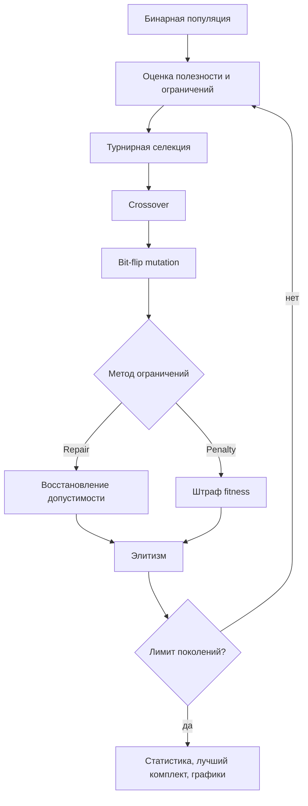

# Отчёт по лабораторной работе №2

## 1. Постановка задачи
Вариант 5: выбрать комплект оборудования лаборатории, максимизирующий суммарную полезность при ограничениях бюджета, мощности и совместимости.

Используется 40 объектов. Ограничения: стоимость не более `2 000 000` руб., мощность не более `18 000` Вт, конфликтующие пары не выбираются одновременно.

## 2. Представление
Особь — бинарная строка длины 40. `1` означает включение объекта, `0` — исключение. Такое кодирование непосредственно описывает множество выбранного оборудования.

## 3. Данные
Синтетические данные генерируются `generate_data.py` с фиксированным seed `20260927`. Готовые данные приложены в `data/`. Процедура воспроизводима.

## 4. Ограничения
Сравниваются два подхода:
- `repair`: после crossover/mutation решение восстанавливается до допустимого;
- `penalty`: нарушение бюджета, мощности и совместимости уменьшает fitness.

## 5. Операторы и эксперименты
Популяция 80, 250 поколений, tournament `k=3`, элита 2, crossover probability `0.9`, bit mutation `0.03`, 20 независимых запусков.

Сравнения:
1. `GA_repair_uniform` vs `GA_penalty_uniform` — меняется только обработка ограничений.
2. `GA_repair_uniform` vs `GA_repair_onepoint` — меняется только crossover.
3. Сравнение с `RandomFeasibleSearch` при том же бюджете оценок кандидатов: `80 × (250+1) = 20080` оценок на запуск.
4. `Greedy` сохранён как дополнительная конструктивная эвристика.

## 6. Допустимые и недопустимые примеры
`results/examples.csv` содержит не менее двух допустимых и двух недопустимых решений, включая превышение ресурсов и конфликт совместимости.

## 7. Представление лучшего решения
Файлы `results/best_*.csv` содержат предметно понятные таблицы выбранного оборудования с ценой, мощностью, полезностью и итогами.

## 8. Графики и статистика
`results/convergence.png` показывает среднюю лучшую полезность по поколениям для 20 запусков. `results/comparison.png` сравнивает распределения итоговой полезности алгоритмов. `results/runs.csv` содержит результаты отдельных запусков, `summary.txt` — best/mean/median/std/worst.

## 9. Вывод
Бинарное представление естественно соответствует задаче выбора набора. Repair гарантирует допустимость потомков перед их дальнейшим использованием, penalty позволяет эволюции работать и с недопустимыми кандидатами. Сравнение выполняется сериями запусков; RandomFeasibleSearch использует тот же бюджет оценок, поэтому является более честным стохастическим baseline, а Greedy служит дополнительным конструктивным ориентиром.
